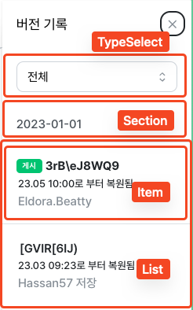

# 버전 기록

* [제공 API](#---api)
  + [API 목록](#api---)
  + [실제 VersionHistory API 의 사용영역](#---versionhistory-api-------)
* [필요 데이터 형태](#---------)
  + [basic](#basic)
  + [accordion](#accordion)
* [VersionHistoryManager 사용방법](#versionhistorymanager-----)
  + [VersionHistoryManager Props](#versionhistorymanager-props)
  + [VersionHistoryManager 예제](#versionhistorymanager---)

## 제공 API

### API 목록

<table>
    <thead>
        <tr>
            <th colspan="2">API</th>
            <th>Description</th>
        </tr>
    </thead>
    <tbody>
        <tr>
            <td colspan="2">VersionHistoryManager</td>
            <td>일반적으로 해당 API 만 사용합니다. "basic", "accordion" 형태를 props 로 제공합니다.</br>만약 커스텀하게 사용하고 싶다면 "VersionHistory" API 를 사용합니다.</td>
        </tr>
        <tr>
            <td rowspan="9">VersionHistory</td>
        </tr>
        <tr>
            <td>Panel</td>
            <td>버전 기록에 Drawer 역활을 수행하는 컴포넌트입니다.</td>
        </tr>
        <tr>
            <td>Section</td>
            <td>버전 기록은 기본적으로 월별로 그룹화되며 Section 은 월을 나타내는 컴포넌트입니다.</td>
        </tr>
        <tr>
            <td>TypeSelect</td>
            <td>버전 기록의 종류를 선택할 수 있는 컴포넌트입니다.</td>
        </tr>
        <tr>
            <td>List</td>
            <td>버전 기록의 리스트 컴포넌트이며 기본적으로 ul 태그입니다. Item 을 li 태그로 사용할 때 사용합니다.</td>
        </tr>
        <tr>
            <td>Item</td>
            <td>버전 기록의 카드를 나타내는 컴포넌트입니다. 복원, 미리보기, 카드 이름 수정 기능을 사용할 수 있습니다.</td>
        </tr>
        <tr>
            <td>EmptyState</td>
            <td>버전 기록의 데이터가 없을 때 사용하는 컴포넌트입니다.</td>
        </tr>
        <tr>
            <td>ErrorState</td>
            <td>버전 기록에 오류가 났을 경우 사용하는 컴포넌트입니다.</td>
        </tr>
        <tr>
            <td>LoadingState</td>
            <td>버전 기록에 로딩을 표시할 때 사용하는 컴포넌트입니다.</td>
        </tr>
        <tr>
            <td colspan="2">transformToHistorySections</td>
            <td>일반적인 형태의 버전 기록을 사용할 때 데이터 전처리에 필요한 함수입니다.</td>
        </tr>
        <tr>
            <td colspan="2">transformToAccordionHistorySections</td>
            <td>아코디언 형태의 버전 기록을 사용할 때 데이터 전처리에 필요한 함수입니다.</td>
        </tr>
        <tr>
            <td colspan="2">getHistoryName</td>
            <td>history 의 savedAt 과 name 의 값에 따라 history name 을 파싱할 때 필요한 함수입니다.</td>
        </tr>
    </tbody>
</table>

### 실제 VersionHistory API 의 사용영역



## 필요 데이터 형태
백엔드에서 내려줘야 되는 API 스펙입니다.

```ts
type History = {
  id: number;
  name: string;
  savedAt: string;
  type: HistoryType;
  userName: string;
  userId: number;
  origin?: History;
};
```


각 형태에 필요한 API 스펙과 데이터를 얻는 방법은 다음과 같습니다.

### basic

```ts
type HistorySection = {
  date: string;
  histories: History[];
};

const historySections: HistorySection[] = transformToHistorySections(histories);
```

### accordion
```ts
type AccordionHistorySection = {
  date: string;
  historyGroups: {
    name: string;
    histories: History[];
  }[]
};

const historyAccordionSections: AccordionHistorySection[] = transformToAccordionHistorySections(histories);
```


## VersionHistoryManager 사용방법

### VersionHistoryManager Props

<table>
    <thead>
        <tr>
            <th>Props</th>
            <th>Required</th>
            <th>Type</th>
            <th>Related</th>
            <th>Description</th>
        </tr>
    </thead>
    <tbody>
        <tr>
            <td>error</td>
            <td style="text-align: center">✅</td>
            <td>unknown</td>
            <td style="text-align: center">history</td>
            <td>히스토리 에러</td>
        </tr>
        <tr>
            <td>isError</td>
            <td style="text-align: center">✅</td>
            <td>boolean</td>
            <td style="text-align: center">history</td>
            <td>히스토리 에러 여부</td>
        </tr>
        <tr>
            <td>refetch</td>
            <td style="text-align: center">✅</td>
            <td>() => void</td>
            <td style="text-align: center">history</td>
            <td>히스토리 리패치</td>
        </tr>
        <tr>
            <td>isLoading</td>
            <td style="text-align: center">✅</td>
            <td>boolean</td>
            <td style="text-align: center">history</td>
            <td>히스토리 로딩 여부</td>
        </tr>
        <tr>
            <td>histories</td>
            <td style="text-align: center">✅</td>
            <td>History[]</td>
            <td style="text-align: center">history</td>
            <td>히스토리</td>
        </tr>
        <tr>
            <td>isRestoreLoading</td>
            <td style="text-align: center">✅</td>
            <td>boolean</td>
            <td style="text-align: center">restore</td>
            <td>복원 로딩 여부</td>
        </tr>
        <tr>
            <td>onClickRestore</td>
            <td style="text-align: center">✅</td>
            <td>(history: History) => Promise<void></td>
            <td style="text-align: center">restore</td>
            <td>복원 클릭 시 동작 콜백 함수</td>
        </tr>
        <tr>
            <td>onClickPreview</td>
            <td style="text-align: center">❌</td>
            <td>(history: History) => void</td>
            <td style="text-align: center">preview</td>
            <td>미리보기 클릭 시 동작 콜백 함수</td>
        </tr>
        <tr>
            <td>previewOriginUrl</td>
            <td style="text-align: center">✅</td>
            <td>string</td>
            <td style="text-align: center">preview</td>
            <td>미리보기 기본 url</td>
        </tr>
        <tr>
            <td>onChangeTitle</td>
            <td style="text-align: center">✅</td>
            <td>(history: History, newTitle: History['name']) => Promise<void></td>
            <td style="text-align: center">title</td>
            <td>제목 변경 시 동작 콜백 함수</td>
        </tr>
        <tr>
            <td>versionHistoryType</td>
            <td style="text-align: center">✅</td>
            <td>{ label: string; value: string; }[]</td>
            <td style="text-align: center">version type</td>
            <td>버전 기록 타입</td>
        </tr>
        <tr>
            <td>defaultVersionHistoryType</td>
            <td style="text-align: center">✅</td>
            <td>string</td>
            <td style="text-align: center">version type</td>
            <td>기본 버전 기록 타입</td>
        </tr>
        <tr>
            <td>onChangeVersionHistoryType</td>
            <td style="text-align: center">❌</td>
            <td>(selectedValue: string) => void</td>
            <td style="text-align: center">version type</td>
            <td>버전 기록 타입 변경 시 동작 콜백 함수</td>
        </tr>
        <tr>
            <td>accordion</td>
            <td style="text-align: center">❌, default: false</td>
            <td>boolean</td>
            <td style="text-align: center">accordion</td>
            <td>아코디언 여부</td>
        </tr>
        <tr>
            <td>withinPortal</td>
            <td style="text-align: center">❌, default: true</td>
            <td>boolean</td>
            <td style="text-align: center">drawer</td>
            <td>drawer 포탈 여부</td>
        </tr>
        <tr>
            <td>portalTarget</td>
            <td style="text-align: center">❌</td>
            <td>string | HTMLElement | undefined</td>
            <td style="text-align: center">drawer</td>
            <td>drawer 포탈 타겟</td>
        </tr>
        <tr>
            <td>portalProps</td>
            <td style="text-align: center">❌</td>
            <td><a href="https://mantine.dev/core/drawer/?t=props" target="_blank">여기 참고</a></td>
            <td style="text-align: center">drawer</td>
            <td>drawer 포탈 props</td>
        </tr>
        <tr>
            <td>opened</td>
            <td style="text-align: center">✅</td>
            <td>boolean</td>
            <td style="text-align: center">drawer</td>
            <td>drawer 오픈 여부</td>
        </tr>
        <tr>
            <td>close</td>
            <td style="text-align: center">✅</td>
            <td>() => void</td>
            <td style="text-align: center">drawer</td>
            <td>drawer 닫기</td>
        </tr>
    <tbody>
</table>

### VersionHistoryManager 예제

```tsx
const {
  data,
  isLoading,
  isError,
  refetch,
  error
} = useBaseQuery({
  //...
});
const {
  opened,
  handler
} = useDisclosure();
const {
  mutate,
  isLoading: isRestoreLoading
} = useMutation({
  //...
})

<VersionHistoryManager
  // NOTE: History props
  error={error}
  isError={isError}
  refetch={refetch}
  isLoading={isLoading}
  histories={transformToHistorySections(data)}

  // NOTE: restore props
  isRestoreLoading={isRestoreLoading}
  onClickRestore={async (history: History) => await mutateAsync(history.id)}

  // NOTE: preview props
  onClickPreview={() => {}}
  previewOriginUrl="https://inflearn.com/roadmaps"

  // NOTE: title props
  onChangeTitle={async (history: History) => await mutateAsync(history.id)}

  // NOTE: version type props
  versionHistoryType={[
    {
      label: '전체',
      value: '전체',
    },
  ]}
  defaultVersionHistoryType="전체"
  onChangeVersionHistoryType={() => {}}

  // NOTE: accordion props
  accordion={false}

  // NOTE: style & drawer component props
  withinPortal={true}
  portalTarget="body"
  portalProps={{}}
  opened={opened}
  close={handler.close}
/>
```